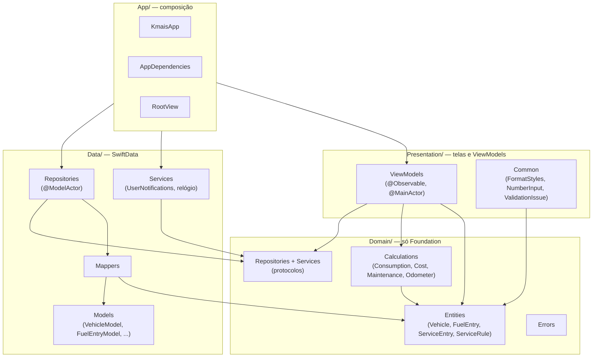

# Arquitetura

Três camadas dentro de um único target do app. A separação é por pasta e por
convenção — não por módulo. Veja o [ADR 0001](adr/0001-arquitetura.md) para o
que isso garante e o que não garante.

## Regras de dependência

| Camada | Pode depender de | Nunca depende de |
|---|---|---|
| `Domain` | Foundation | SwiftUI, SwiftData, `Data`, `Presentation` |
| `Data` | `Domain`, SwiftData, Foundation | `Presentation` |
| `Presentation` | `Domain`, SwiftUI, Foundation | `Data` |
| `App` | todas | — |

`App/AppDependencies` é o único lugar que instancia tipo concreto. Qualquer
outro arquivo que precise saber que existe SwiftData por trás é vazamento.

## Fluxo de uma escrita

1. A view chama um método do ViewModel.
2. O ViewModel monta uma **entidade** de domínio e chama o protocolo do
   repositório.
3. O repositório — um `@ModelActor` — resolve o `@Model` correspondente pelo
   `id`, aplica o mapper e efetiva `context.save()`.
4. O ViewModel recarrega o que precisa e atualiza seu estado.

Cada repositório tem seu **próprio** `ModelContext`, consequência de
`@ModelActor`. Por isso toda escrita efetiva `save()` antes de retornar: sem
isso, um repositório não enxerga o que o outro acabou de gravar.

## Leitura: por que não `@Query`

Ver o ADR. Em resumo: `@Query` liga a view ao `@Model`, o que derruba a
fronteira inteira. O custo assumido é recarregar após cada escrita, até o
`ResultsObserver` do iOS 27 entrar dentro das implementações de repositório —
encaixe aditivo, sem mudar os protocolos.
